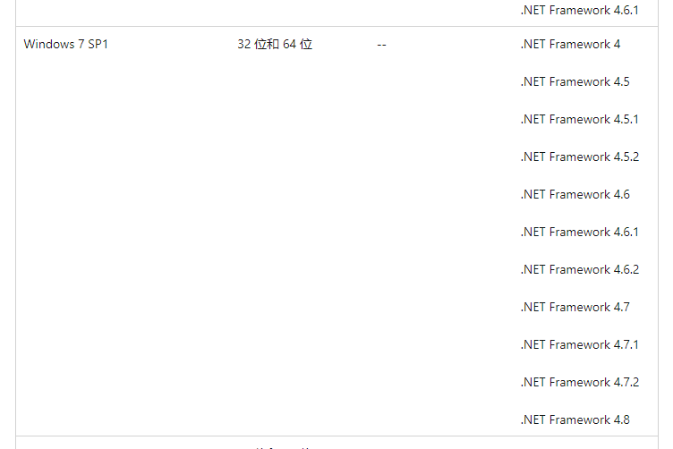
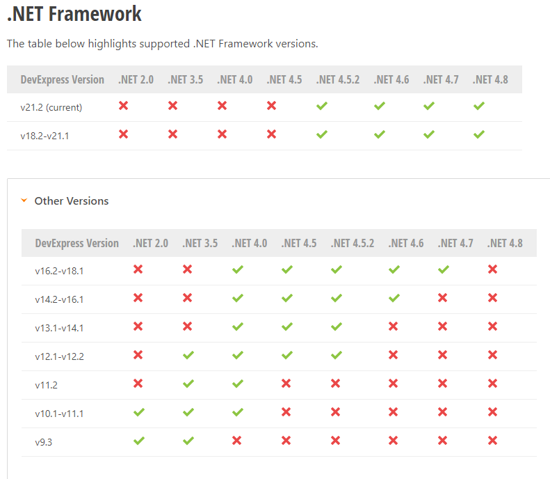
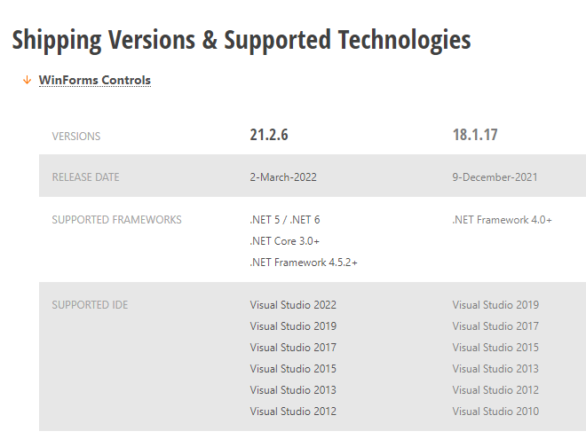

### Windows和.NetFramework版本兼容关系
https://docs.microsoft.com/zh-cn/dotnet/framework/get-started/system-requirements

#### Win7支持.NetFramework版本

### .NetFramework版本支持
https://dotnet.microsoft.com/zh-cn/download/dotnet-framework

### DevExpress支持

#### DevExpress支持.Net版本
https://docs.devexpress.com/WindowsForms/8092/prerequisites

#### DevExpress支持.Net版本和IDE版本
https://www.devexpress.com/Support/Versions.xml

### WebBrowser框架组件
以下全部基于chromium内核

对于.NetFramework4.0，只有1、2支持.NetFramework4.0，Cef.Sharp可自行修改编译添加支持

1. MiniBlink：问题多，性能低，不支持anycpu，阉割版chromium，但体积小（单平台20M左右)
2. EO：功能强大，兼容性强，体积较小（100M+），但是收费
3. WebView2：微软官方支持，但需额外安装运行时，或依赖Edge，且文档少，不成熟，是否适用生产环境？（运行时模式单平台120M+，嵌入打包模式单平台300M+）
4. Cef.sharp：完善成熟框架，支持anycpu，唯一问题就是体积太大，（单平台200M+，anycpu450M+）

